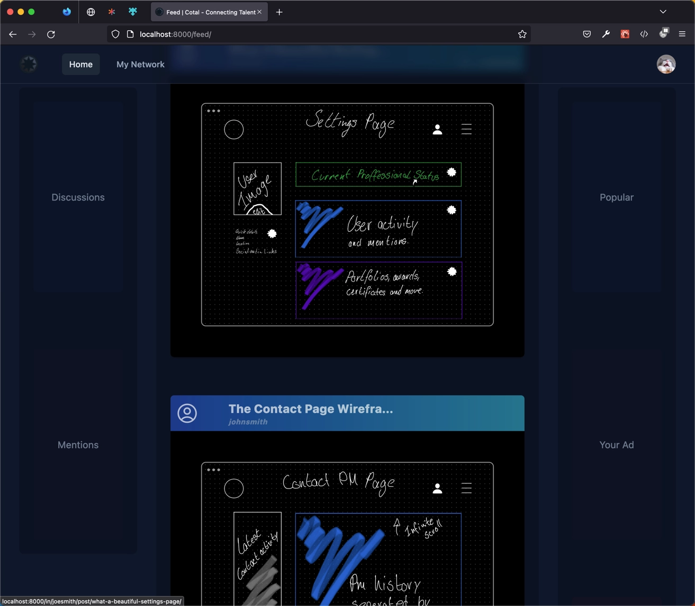
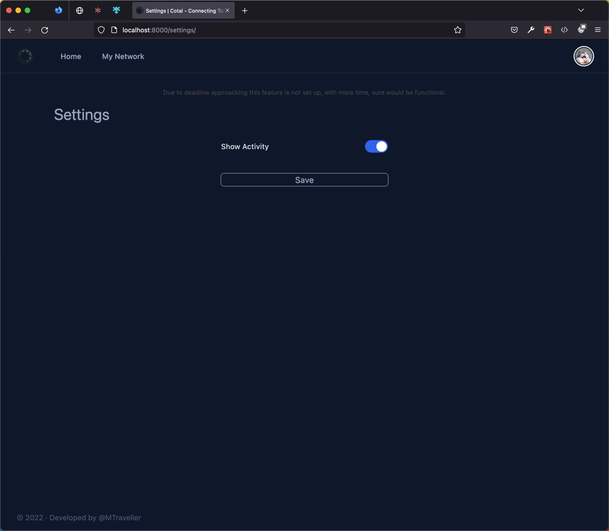

# The 5th Project Portfolio of CI

## Cotal

Frontend Project URL: [View live project](https://cotal.netlify.app 'Cotal')

Backend Project URL: [View live project](https://cotal-api.herokuapp.com 'Cotal-DRF')

Backend Project REPO: [View live project](https://github.com/MTraveller/cotal-drf 'Cotal-DRF')

 

 

## User stories

User stories were created at the beginning of the project before any actual coding began.

See completed and not completed user stories [here](./user-stories.md 'User Stories')

    

## Table of Contents

- [Planes](#planes)
  - [The Surface](#surface)
  - [Skeleton](#skeleton)
  - [Structure](#structure)
  - [Scope](#scope)
  - [Strategy](#strategy)
- [Development](#development)
  - [HTML](#dev-html)
  - [CSS](#dev-css)
  - [Python](#dev-python)
  - [Testings](#testings)
  - [Bugs](#bugs)
- [Validator](#validator)
- [Deployment](#deployment)
  - [Fork](#fork)
  - [Clone](#clone)
  - [Deploy](#deploy)
- [Credits](#credits)

 

## Planes

 

### Surface

The colors used for this project are the following: some light blue, pink, yellow, and lime green are also used.

The logo and loader were made by myself, and images were taken from rotating backgrounds on my Samsung phone.

 

 

Feed page

 

Network page

 

Account page

 

Setting page

 

Profile page

 

Post page

 

#### Wireframe

|                         Mobile                         |         Desktop         |
| :----------------------------------------------------: | :---------------------: |
| Not Done, but is fully responsive throughout the site. | see wireframes [here]() |

 

- #### Colour Scheme

  -

  | #HEX | Color |
  | :--: | :---: |
  |  #   |  |

   

  #### Typography

  -  is used to give the app a ....

   

- #### Imagery

  - The purpose of the images is to make the app more appealing.
  - The colors and images all serve to be aligned with and assist in the app's branding.
  - The images also intend to give the app an identity the user can relate to, lifting its overall impression.

   

  - Favicon image:

   

  

   

  - Social image card:

   

  

 

### Skeleton

On top, there's the header; in the middle, the main content area; and at the bottom, the footer. The content is centered with two sidebars that can show related information to the user. The navigation is sticky and will follow the user while scrolling on both mobile and desktop.

 

### Structure

Data is structured around the user, the user is the main focus.

 

### Scope

What features,(nvp), both ability and desires?

#### Minimum viable product

Can add content
can add images
can comment

#### Desired features

messaging
networking
following

 

### Strategy

The site's goal is to bring young people together and encourage them to work together to create jobs for themselves. Together, they can begin an adventurous journey.

 

## Development

#### Languages Used

- [HTML](https://en.wikipedia.org/wiki/HTML "Wikipedia's HTML page")
- [CSS3](https://en.wikipedia.org/wiki/Cascading_Style_Sheets "Wikipedia's CSS3 page")
- [JavaScript](https://en.wikipedia.org/wiki/JavaScript "Wikipedia's JavaScript page")
- [Python](<https://en.wikipedia.org/wiki/Python_(programming_language)> "Wikipedia's Python page")

 

### Frameworks, Libraries & Programs Used

 

1. [Mockflow:](https://mockflow.com/ 'mockflow.com')
   - Mockflow was used to create the wireframes during the design process.
2. [Git:](https://git-scm.com/ 'git-scm.com')
   - Git was used for version control by utilizing the Gitpod terminal to commit to Git and Push to GitHub.
3. [GitHub:](https://github.com/ 'github.com')
   - GitHub is used to store the project's code after being pushed from Git.
4. [Heroku:](https://www.heroku.com 'heroku.com')
   - Heroku is a container-based cloud Platform as a Service (PaaS). Developers use Heroku to deploy, manage, and scale modern apps. Project is hosted on Heroku for viewing and interacting with the app.
5. [Django](<https://en.wikipedia.org/wiki/Django_(web_framework)> 'wikipedia.com')
   - Django is a high-level Python web framework that encourages rapid development and clean, pragmatic design.
6. [VisualStudioCode](https://code.visualstudio.com 'https://code.visualstudio.com')

   - Visual Studio Code is a code editor redefined and optimized for building and debugging modern web and cloud applications.

tailwindcss

styled components

Affinity designer

mockup ux & ui

vscode

yarn

gatsby

axios

react icons

dotenv

prettier

## Testings

### Lighthouse

 

### Bugs

I have grown fond of eliminating bugs found in my code as I intentionally try to provoke and find them. All known bug were fixed.

 

## Validator

JS validator through VSCode.

 

## Deployment

 

### Fork

How to fork this repository:

1. Log in to GitHub and navigate to [this repository](https://github.com/MTraveller/bookable).
2. You'll see a button called <b>Fork</b> on the top right side of the page. Click the button to create a copy of this repository to your own GitHub account.

 

### Clone

How to clone this project:

1. Under the repository’s name, click on the <b>Code</b> button.
2. In the <b>HTTPS</b> tap, click on the clipboard icon to copy the given URL.
3. In your IDE of choice, open <b>**git bash**</b>.
4. Change the current working directory to where you want the cloned directory to be.
5. Type <b>**git clone**</b>, paste the URL copied from GitHub - https://github.com/MTraveller/bookable.git.
6. Press <b>**enter**</b>, and you are done.

 

### Development

Download the repo and install yarn. Then write yarn install and yarn will install all dependencies. There after you can do one of the following.

yarn start to start the development
yarn build to build an optimized version
yarn serve to serve as production.

the env.development and env.production needs edit.

that it.

### Deploy

To deploy to netlify, simply sign up to netlify and connect your account. Adding this repo this your own repo and connecting netlify with your repo will automatically deploy this project on netlify.

 

## Credits

 

### Sources Used

[React Docs](https://reactjs.org 'react')
[Gatsby Docs](https://www.gatsbyjs.com/docs)
[Reach router Docs](https://reach.tech/router/)
[Mozilla Docs](https://developer.mozilla.org/en-US/)

 

## Acknowledgement

No code within this project is a copy unless specified explicitly in the source code—Code Institute provided the base template for this project. The sources used above provided guidance throughout the development.

This project is part of the "Full Stack Software Developer Diploma" at [Code Institute](https://codeinstitute.net/).

MT 2022.

[Back to top](#the-4th-project-portfolio-of-ci)
